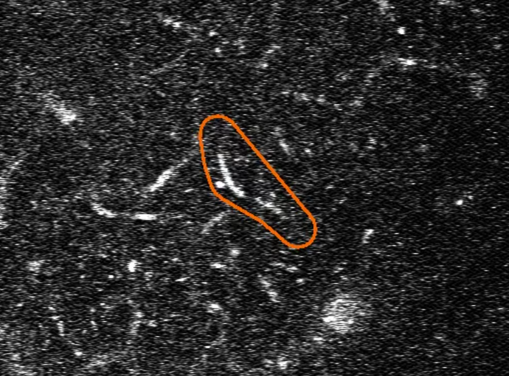
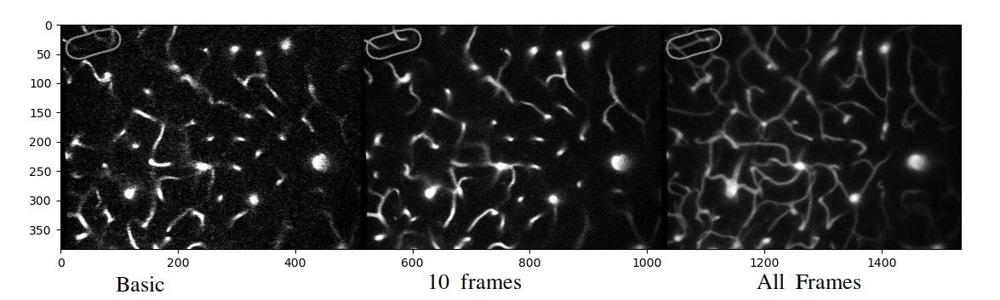
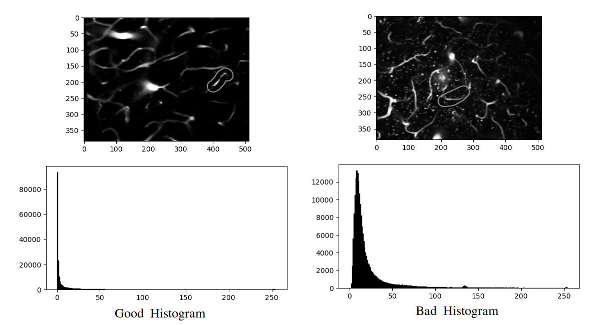
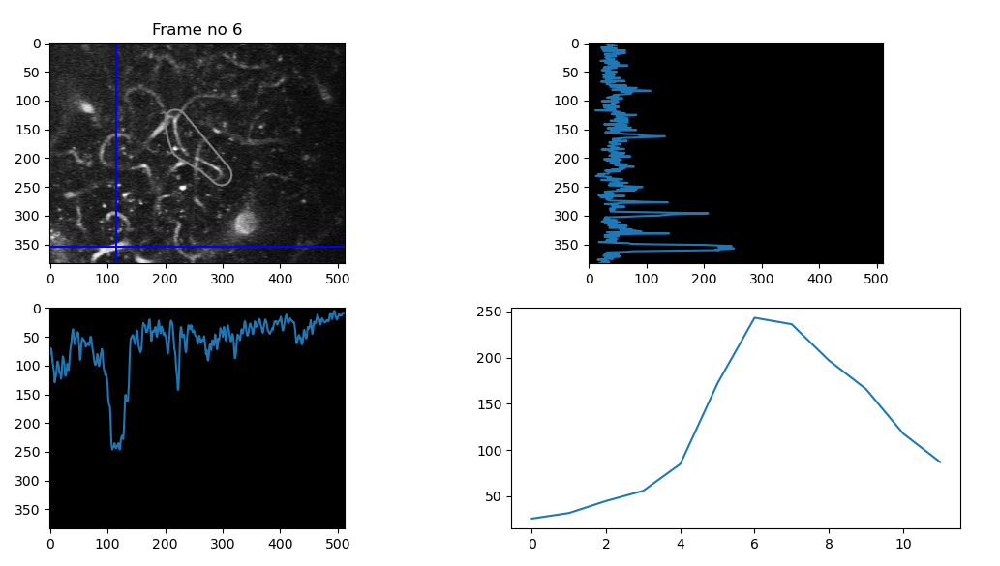
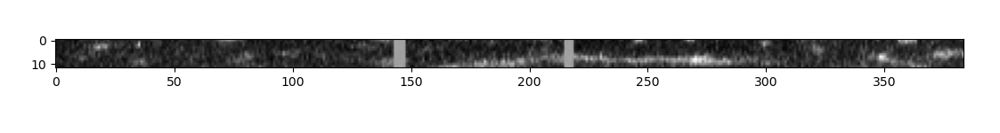
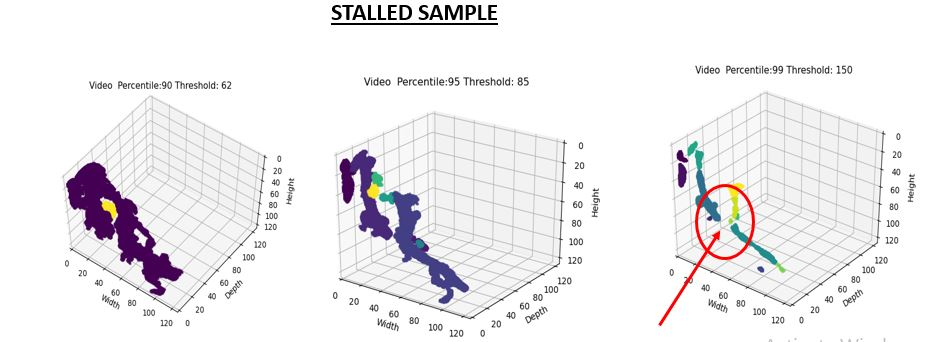
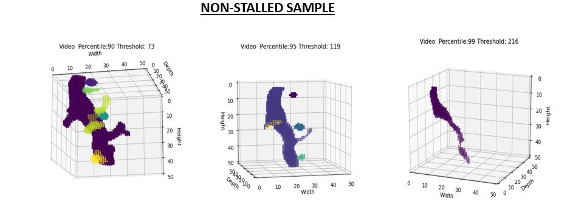
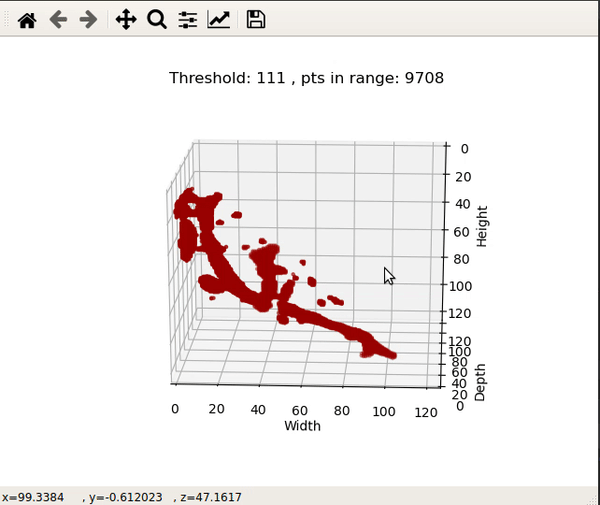
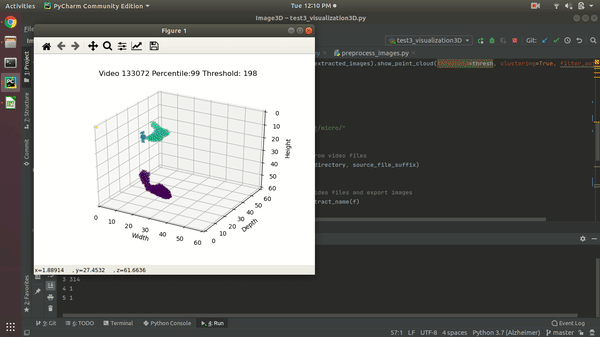

# Dataset Visualization and Processing

The Alzheimer stall catchers dataset contains video files as data instances. In each of the video sample, there are circled ROIs (regoins of interest) where stall is to be detected.


## <a href="https://github.com/ClockWorkKid/Alzheimers-Stall-Catchers/blob/master/Dataset%20Visualization%20and%20Processing/preprocess_images.py">preprocess_images.py</a>

By nature the original image frames are in grayscale, and the ROI marking is done in an orange color. Thus this color can be easily detected to crop out the region of interest from a frame. This is the first processing step on the entire dataset.

### Frame extraction

class **VideoProcessor** initializes with a video filename.

**process_video()** function extracts the frames from a video file. There are three optional parameters to this function.
```
process_video(self, roi_extraction=False, filter_enabled=False, average_frames=False)
``` 
**roi_extraction = True** enables cropping the marked region of interest using the extract_ROI_from_collection() function.

**filter_enabled = True** enables <a href="https://docs.scipy.org/doc/scipy-0.16.0/reference/generated/scipy.ndimage.filters.gaussian_filter.html">3D Gaussian Blur</a> of the stacked image frames extracted from video file. Applying a 3D Gaussian Blurring operation improves the noise condition of the video data.

**average_frames = True** does an average pooling operation with averaging length = chunk_size and stride = frame_overlap. Frame averaging also gives better results in terms of noise performance, and reduces overall frame count.

Averaging all frames of the entire clip results in an overall map of blood vessels present in the video file, but there is some loss of important detail. Noise performance is fairly good


Noise condition of the images seem to be apparent from the histogram of the frames. In general, images with more noise have a wider histogram, and good images have a narrower histogram. Histogram operations have been tried, but the results are not good. Histogram equalization gave noisier images. Some sort of histogram squeezing has to be done to obtain better lit images


Did some investigating with pixel intensity values. From the plots of a single row, column or a column taken in direction of depth, the presence of vessels can be observed from concurrent high pixel values. I have an idea for filtering the images with a low pass filter in any one of the three directions.


When a 3d array is viewed from the side, the vessels can be seen too, and it can give a rough estimation of depth diffence between consecutive frames.



### Point Cloud Generation
process_video() function of the VideoProcessor class returns a 3D stack of grayscale images with/without filtering and cropping. Now binary thresholding operation of these 3D arrays can give us point cloud of the vessels.

**ImageProcessor3D** class has a method 
```
point_cloud_from_collecton(image_collection, threshold=100, filter_outliers=False)
```
This function is probably the most important part of the point cloud dataset. The first parameter **image_collection** takes in a 3D array of stacked images. **threshold** is the value(0-255) above which all pixels are considered as a point on a blood vessel, and pixels below the threshold are regarded as empty space. As a result, the point cloud of blood vessels is returned. Finally, **filter_outliers** does a <a href="https://scikit-learn.org/stable/modules/generated/sklearn.cluster.DBSCAN.html">DBSCAN clustering</a> on the raw point cloud, essentially filtering out the smaller clusters not to be considered as blood vessels. 

If all pixel values in a 3D array of images is valued in the range 0-255, threshold values are taken for 90, 95, 99 th percentile pixel values, and after thresholding on that value over the 3D array - 3 Point clouds are generated



- In each point cloud, apply DBSCAN clustering, remove any clusters having points less than 1/100th of the largest cluster
- It is visually possible to classify stalls by comparing the three point clouds

## <a href="https://github.com/ClockWorkKid/Alzheimers-Stall-Catchers/blob/master/Dataset%20Visualization%20and%20Processing/visualization_tools.py">visualization_tools.py</a>
This python file is used to observe the dataset for better intuition. In the bottom section of this code:
```
filename = "../../micro/100109.mp4"
extractor = VideoProcessor(filename)
extracted_images = extractor.process_video(roi_extraction=True, filter_enabled=True, average_frames=True)

Interactive(extracted_images).show_point_cloud(percentile=99, clustering=True,
                                                                   filter_outliers=True)
```
Calling the **show_point_cloud()** function invokes a matplotlib window which can be controlled via the scroll wheel. At first, the percentile value for thresholding is at 99, but using the scroll wheel you can change the percentile value on the go to see the effect of different threshold values on the point cloud.

Here is an interactive plot of **100109.mp4** which is a stalled example


Another interactive plot of a nonstalled example:


Finally, comparing the percentile thresholds for different videos:


## <a href="https://github.com/ClockWorkKid/Alzheimers-Stall-Catchers/blob/master/Dataset%20Visualization%20and%20Processing/dataset_generator.py">dataset_generator.py</a>
This file does all the preprocessing required for the point cloud dataset generation. The steps are:
1. All files in the specified folder are first listed
2. Each file is sent to the VideoProcessor class to do ROI extraction -> 3D Gaussian Blur -> Frame Averaging
3. A 3D array of images corresponding to a video is obtained. Now point cloud is generated from the 3D array for 3 percentile thresholds - 90, 95 and 99
4. Point cloud data is binary in nature, each existing point is binary 1, and non existing points are binary 0. Now each of the three point clouds obtained can be used as a mask for the image array obtained in step 1. The point clouds are converted to voxels with the same shape as the original 3D array of images. These voxel grids have value 1 where point cloud had points, and value 0.2 where point cloud did not have points (essentially suppressing pixel values where there are no blood vessels). After obtaining 3 voxel grids of percentile values 90, 95 and 99, these are used for masking the original 3D array of images
5. We now have 3 versions of the extracted 3D arrays in step 2. These 3 versions are taken as 3 channels of a 3D dataset, and the output array is reshaped as 3x32x64x64 (3 channels, 32 depth, 64 height and width).
6. Finally, the 4D array is saved as a tensor file of the same name.

## References
1. Point Cloud Materials
    - http://www.open3d.org/
    - https://docs.scipy.org/doc/scipy/reference/generated/scipy.ndimage.gaussian_filter.html#scipy.ndimage.gaussian_filter
    - https://paperswithcode.com/task/3d-point-cloud-classification
    - https://github.com/charlesq34/pointnet
    - https://github.com/charlesq34/pointnet2
    - https://github.com/WangYueFt/dgcnn
    - https://towardsdatascience.com/5-step-guide-to-generate-3d-meshes-from-point-clouds-with-python-36bad397d8ba

2. 3D convolution
    - https://towardsdatascience.com/step-by-step-implementation-3d-convolutional-neural-network-in-keras-12efbdd7b130
    - https://www.kaggle.com/daavoo/3d-mnist
