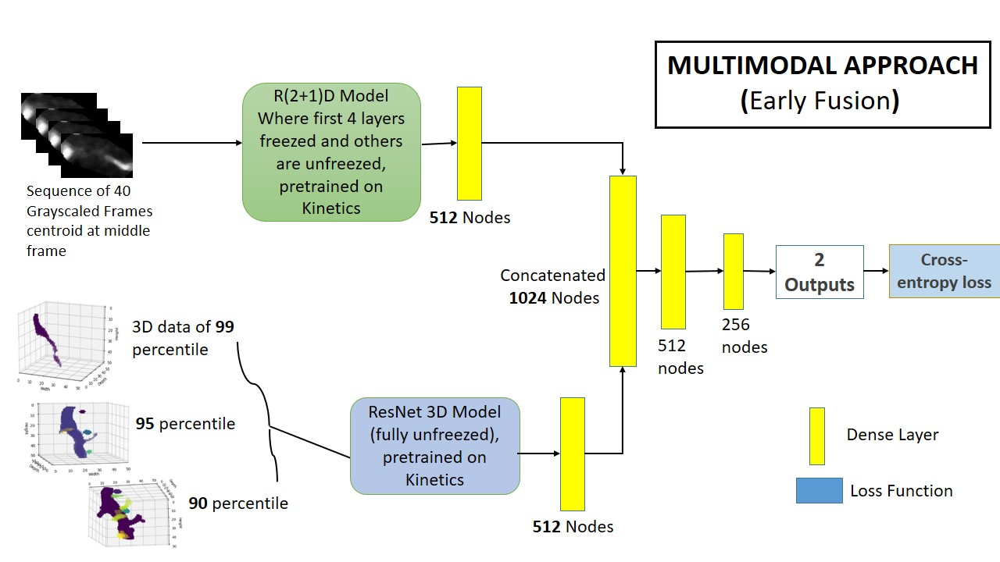

Multimodal approach using voxel from point cloud and image was experimented after getting good result both on image and point cloud alone. Training and Inference code for that is given.

# Multimodal Approach Summary

The multimodal approach of image data and point cloud data was experimented at the earlier stage of the competition. We used early fusion at dense layer of two modals. These approach has great protential to achieve staggering score if it can be utilized properly. Later we shift to late fusion after improving each individual modal. We haven't tried this early fusion after getting best score from individual stage and so we believe it can be useful for future work. A summary of whole work is given below :

