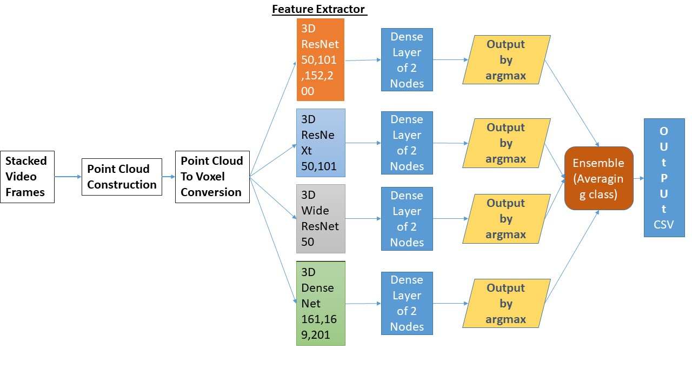

# Point Cloud Dataset Generation

- First make sure that the "micro" or "test" datasets from the **Alzheimer Stall Catchers** competition is locally available.

- Open the <a href="https://github.com/ClockWorkKid/Alzheimers-Stall-Catchers/blob/master/Dataset%20Visualization%20and%20Processing/dataset_generator.py">dataset_generator.py</a> python file. Go to the bottom portion of the code and modify the following:
```
# Location of original dataset
src_directory = "../../dataset/micro/"

# Target Location of converted dataset
dst_directory = "../../micro"
```

- In case you simply want to test whether the generator is working properly on a single video file, set the testing flag to True. Otherwise all the video files in the source folder will be converted to point cloud data.
```
Generator().generate_tensor_dataset(src_directory, dst_directory, testing=True)
```
Wait until the process finishes. It will take some time until video data is converted into point cloud format.

For detailed intuition on the point cloud dataset, head on to the <a href="https://github.com/ClockWorkKid/Alzheimers-Stall-Catchers/tree/master/Dataset%20Visualization%20and%20Processing">Dataset Visualization and Processing</a> directory.

# Point Cloud Network Architecture



- <a href="https://github.com/ClockWorkKid/Alzheimers-Stall-Catchers/blob/master/Point%20Cloud%20Based%20Approach/Pointcloud_training_resnet_densenet.ipynb">Pointcloud_training_resnet_densenet.ipynb</a> file trains model for densenet3D and resnet3D variants
- <a href="https://github.com/ClockWorkKid/Alzheimers-Stall-Catchers/blob/master/Point%20Cloud%20Based%20Approach/Pointcloud_inference_resnet_densenet.ipynb">Pointcloud_inference_resnet_densenet.ipynb</a> file does inference on the trained densenet3D/resnet3D model
- <a href="https://github.com/ClockWorkKid/Alzheimers-Stall-Catchers/blob/master/Point%20Cloud%20Based%20Approach/Train_3DptCloud_clsballoss.ipynb">Train_3DptCloud_clsballoss.ipynb</a> is the notebook for resnext3D and wide resnet models. Here you can also find the implementation for using optimizer scheduler, method for saving full model checkpoints while training for multistage training, and AMP code for short/mixed precision training on the **Tesla T4** GPU for bigger batch sizes speeding up training.
- <a href="https://github.com/ClockWorkKid/Alzheimers-Stall-Catchers/blob/master/Point%20Cloud%20Based%20Approach/Inference_3DptCloud.ipynb">Inference_3DptCloud.ipynb</a> contains code for inference on the trained resnext/wide resnet models
