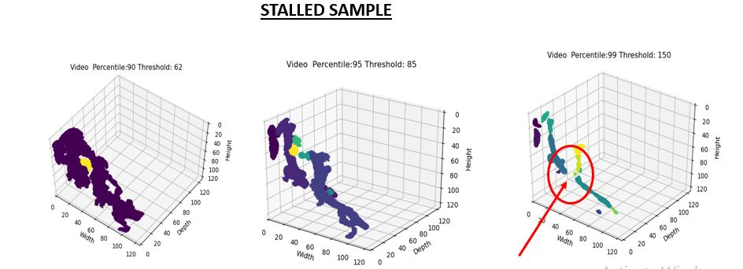

# Alzheimers-Stall-Catchers

> <a href="https://www.drivendata.org/competitions/">Driven-Data</a> Biomedical Research Competition 

> Team **BUET Synapticans** under M-Health Research Lab, Department of Biomedical Engineering, Bangladesh University of Engineering and Technology

> Placed **7th** on private leaderboard with an MCC score of 0.7392

## Table of Contents

- [Overview](#competition-overview)
- [Data Visualization](#data-Visualization)
- [Solution Approach](#solution-approach)
- [Repository Overview](#repository-overview)
- [References](#reference)
- [Team](#team)

# Competition Overview

Head on to the <a href="https://www.drivendata.org/competitions/65/clog-loss-alzheimers-research/page/207/">Alzheimers Stall Catchers Competition</a> website for competition details.

# Data Visualization
This is a competition of constructing a binary classifier. Model has to predict whether the given data is Stalled or Non-stalled. We think to prepare data in two ways to help model differentiating between stalled and non-stalled. 
From the perspective of point cloud, one can easily visualize and differentiate them. For instance :
A Stalled Sample : 

A Non-Stalled Sample : 

# Solution Approach

The proposed solution method primarily comprises of two major pipelines:
 1. Image based approach 
 2. Point cloud based approach
 
Several deep learning classifier models have tested in both approaches, including ResNet, DenseNet, ResNet 3D and several other 3D convolution based models. Implementation details on any model tried and tested on the dataset has been further discussed in detail in the sub directories of the repository. In 'Point Cloud Based Approach' you can find all detailed code for point cloud based approach codes and in 'Image Based Approach' you can find all detailed code for image based approach.

The final submission of the competition was done on the ensemble of best models of the two major pipelines. Ensemble scheme has also been explained in detail.

# Repository Overview

The repository encapsulates the work of all the team members during the competition. The subdirectories contaiin all the major works towards the final submission.
    
 - <a href="https://github.com/ClockWorkKid/Alzheimers-Stall-Catchers/tree/master/Dataset%20Visualization%20and%20Processing">Dataset Visualization and Processing</a> contains code for visualizing the given dataset (video, images with ROI(region of interest) extracted, point cloud of blood vessels, grayscale ROI frame extraction, point cloud extraction)
 - <a href="https://github.com/ClockWorkKid/Alzheimers-Stall-Catchers/tree/master/Image%20Based%20Approach">Image Based Approach</a> contains classification scheme based on image frames extracted from each sample video ROI.
 - <a href="https://github.com/ClockWorkKid/Alzheimers-Stall-Catchers/tree/master/Point%20Cloud%20Based%20Approach">Point Cloud Based Approach</a> contains classification scheme based on point cloud of the given blood vessels present in sample videos.
 - <a href="https://github.com/ClockWorkKid/Alzheimers-Stall-Catchers/tree/master/Final%20Ensemble%20of%20Models">Final Ensemble of Models</a> contains the ensemble scheme of the best models from the previously mentioned two approaches.
 - <a href="https://github.com/ClockWorkKid/Alzheimers-Stall-Catchers/tree/master/Other%20Approaches">Other Approaches</a> contains solution approaches tried during the competition that did not perform expectedly, but has been included in the repository for future reference.

# References

- (empty)

# Team

- Partho Ghosh
- <a href="https://github.com/aia39">Md. Abrar Istiak Akib</a>
- Swapnil Saha
- <a href="https://github.com/ClockWorkKid">Mir Sayeed Mohammad</a>

